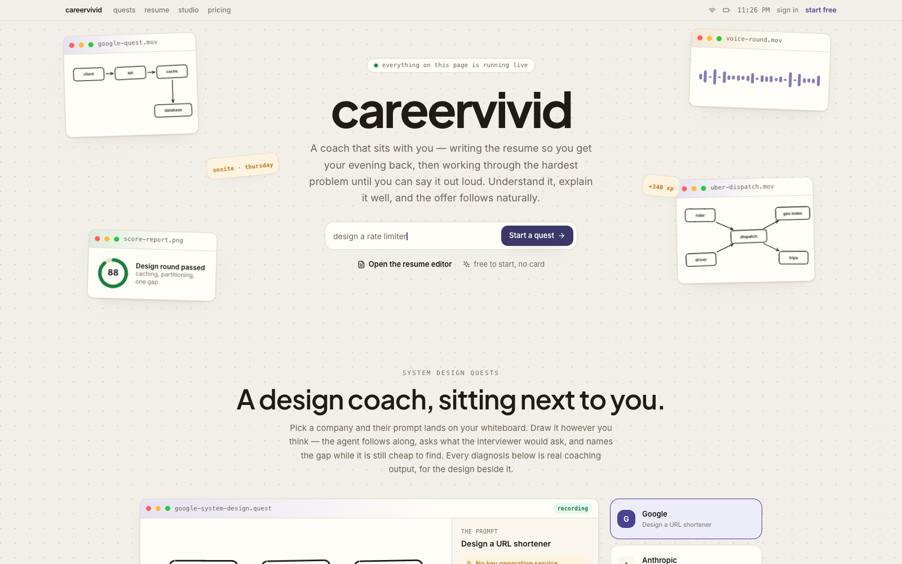
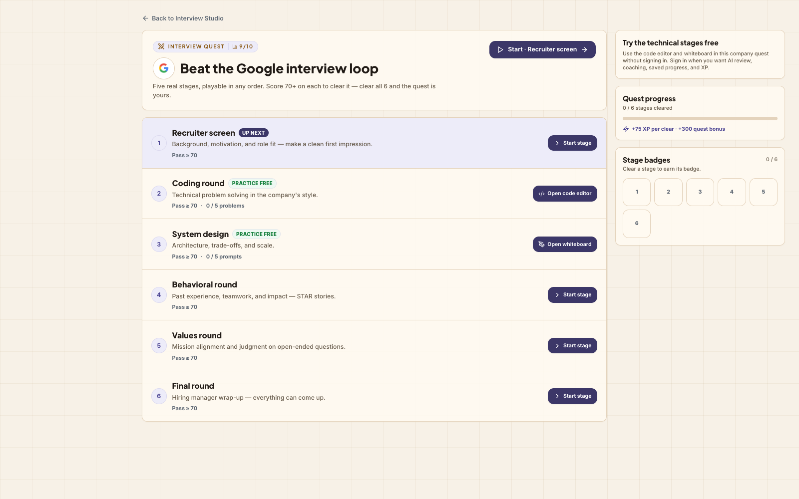
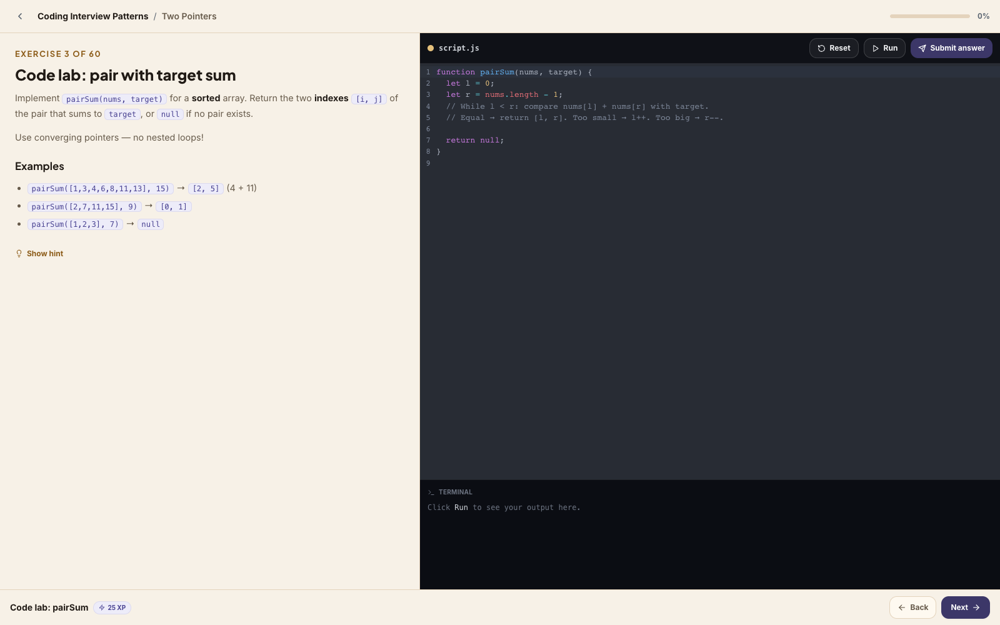
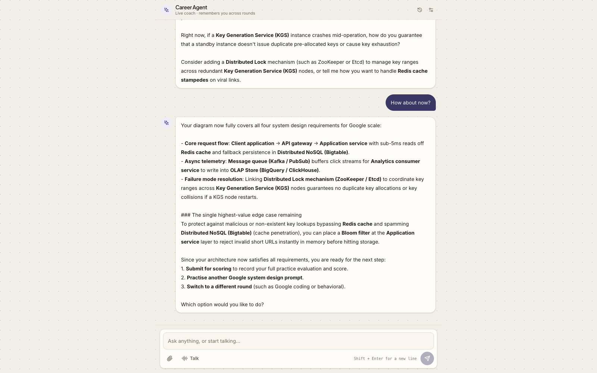
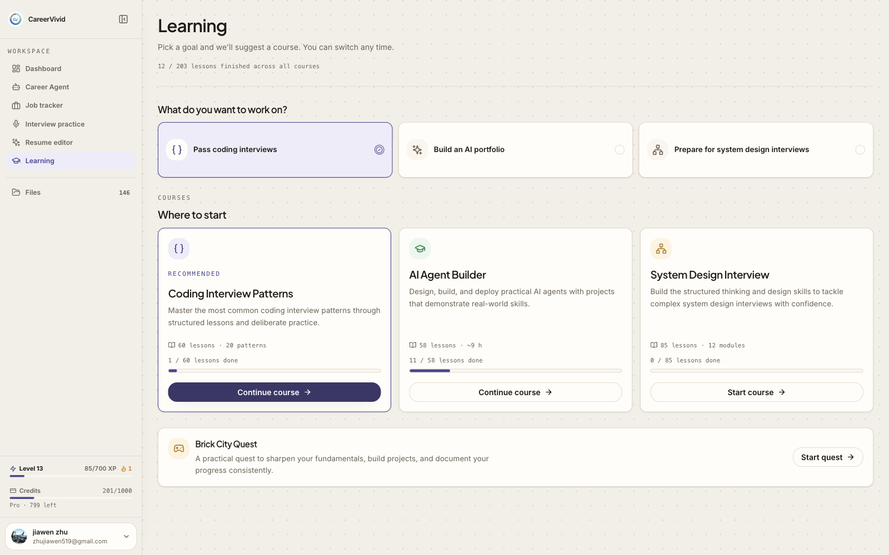
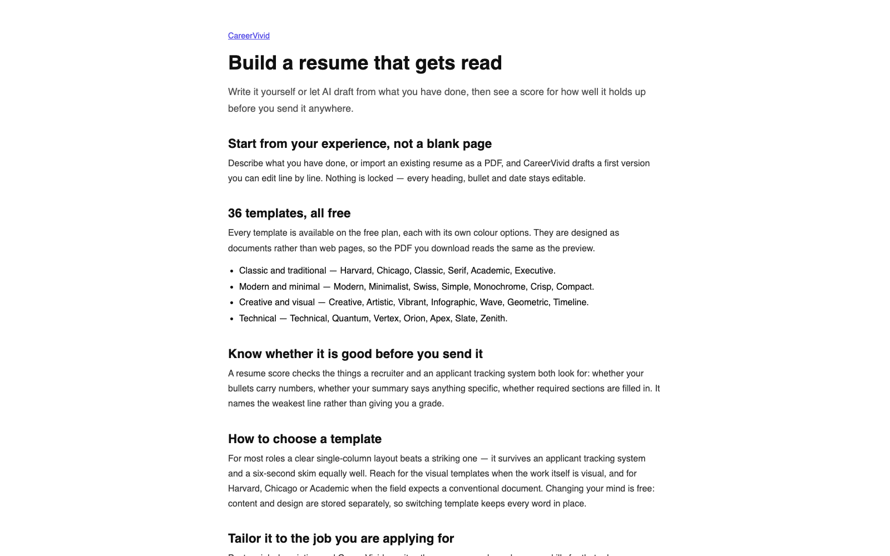
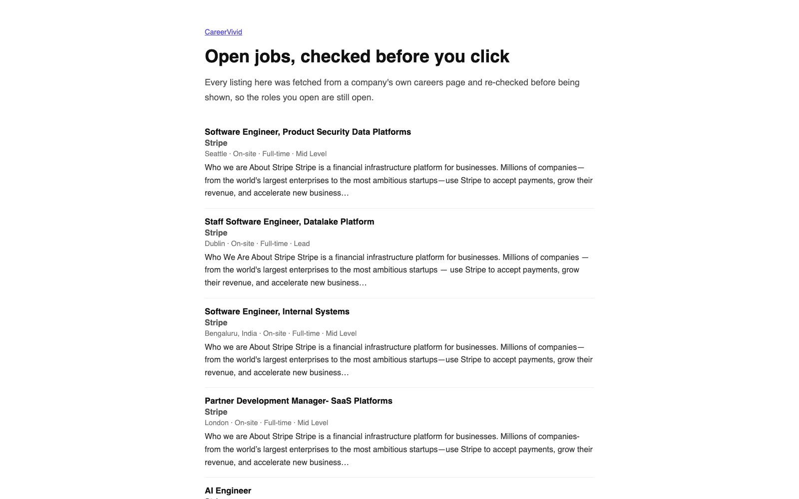

<div align="center">

# CareerVivid

### A job-search workspace where the mock interview is a real spoken conversation, your code is actually executed, your whiteboard is graded against a rubric, and the fixes land in the resume you apply with.

[](https://careervivid.app)
[](#why-education--human-potential)
[](#ai-in-production)
[](#how-it-is-built)

</div>



---

## Try it right now — no account, no card

Every link below opens the **live production app** as a guest. Nothing here is a
sandbox or a seeded demo; it is the same application a paying user gets, with
the signed-in surfaces withheld.

| Open this | What you should see in 30 seconds |
| --- | --- |
| **[careervivid.app/quest/google](https://careervivid.app/quest/google)** ← **start here** | Google's real interview ladder — recruiter screen, coding, system design, behavioural, values, final — each stage with a 70/100 pass mark, built from that company's documented questions. |
| [careervivid.app/learn/coding-interview-patterns/tp-code](https://careervivid.app/learn/coding-interview-patterns/tp-code) | A coding lesson that **runs your Python in the browser** — CPython on WebAssembly, in a worker — and diffs the real output against the expected result. Press Run. |
| [careervivid.app/interview-studio](https://careervivid.app/interview-studio) | 301 companies, 4,551 documented questions, 821 documented stages. Search the company you are actually interviewing at. |
| [careervivid.app/edit/new](https://careervivid.app/edit/new) | The resume editor, open to guests. Write or import one, pick from 36 templates, export to PDF, Google Docs or `.docx` without ever signing in. |

The free plan is a working product, not a trial: 100 credits a month, all 36
templates, every company guide, no card.

---

## The problem

Landing a job costs hundreds of hours, and almost none of that effort produces
feedback. You submit applications into silence. You rehearse answers alone in a
room. You draw a system design on a whiteboard that nobody grades. The loop that
decides your career is the one loop you never get to practise against.

CareerVivid makes that loop runnable. You talk out loud and something answers.
You write code and it executes. You draw an architecture and it is scored
against a rubric. Then the same agent that just watched you fail edits the
resume you apply with.

---

## What it does

### Speak the interview, out loud, in real time

Not a chat window pretending to be an interview. The browser opens a WebSocket
to Vertex AI's Live API, streams **16 kHz mono PCM** from the microphone, and
plays 24 kHz audio back. The model decides when a follow-up is warranted and
when the round is over. The transcript is then scored and written into a report.

`src/components/aiInterviewAgent/useAIInterviewAgentSession.ts` · `gemini-live-2.5-flash-native-audio`


### Run a company's actual interview ladder

Six stages per company, each with a 70/100 pass threshold and a badge. The
questions are documented, not generated — 4,551 real questions scraped and
curated across 301 companies, expanded into 22,611 per-stage quest questions.

`src/lib/companyQuests.ts` · guest-browsable at `/quest/:slug`



### Draw an architecture and have it graded

You draw on a real canvas. The rendered image goes to Gemini with a numeric
rubric and a forced scratchpad, and comes back with a weighted score, named
gaps, and a follow-up question aimed at whatever you left out. The board below
is a live session: the coach has already pushed back on key generation and is
asking how a standby KGS avoids issuing duplicate pre-allocated keys.

`src/services/geminiService.ts:1215` · `gemini-3.6-flash`


### Write code that actually runs

Python executes in Pyodide — CPython compiled to WebAssembly — inside a Web
Worker the host can terminate. The pass rate is **measured**, not estimated, and
the model grades on top of a real result rather than guessing from the source.



### One agent that can see your workspace

The Career Agent has 29 tools and up to 12 tool-calling iterations per turn. It
reads your open code buffer and its test summary, the diagram you are drawing,
and your scored rounds — so it answers about the thing in front of you instead
of asking you to describe it.

**It cannot write anything.** Every mutating tool returns a server-stored
*proposal*; the client approves it by ID and never supplies the payload. An
agent that has been prompt-injected still cannot mutate your data.

`functions/src/agent/turnRunner.ts` · `functions/src/agent/tools.ts` · `gemini-3.6-flash`



### Turn the feedback into the resume you send

36 templates, AI tailoring against a specific posting, a match score across four
named categories, and export to PDF, Google Docs or `.docx`. Guests get the
editor and the exports; sync, AI and sharing need an account.


### And a place to put it all together


<details>
<summary><b>More surfaces</b> — learning catalog, job board, pricing, quest progress</summary>

<br>

12 published courses, 56 chapters, 203 interactive lessons.



The resume editor as a guest sees it — no account, no card, exports enabled.



Live postings from 161 company ATS boards, each re-checked to confirm the role
is still open before it is shown.



Quest progress, XP and stage badges.


One credit pool across every AI surface.


</details>

---

## AI in production

Every scored surface in the deployed application calls the Gemini API. Google
Cloud products in production: **Firebase Auth, Cloud Firestore, Cloud Functions
(139 deployed), Firebase Hosting, and Vertex AI** for the realtime voice session.

| Decision the model makes | Model | Code |
| --- | --- | --- |
| Conducts a spoken interview and decides when it ends | `gemini-live-2.5-flash-native-audio` | `src/components/aiInterviewAgent/useAIInterviewAgentSession.ts` |
| Scores the transcript, writes the feedback report | `gemini-3.6-flash` | `functions/src/agent/reportTools.ts` |
| Grades the whiteboard image against a numeric rubric | `gemini-3.6-flash` | `src/services/geminiService.ts:1215` |
| Grades code on top of a measured pass rate | `gemini-3.6-flash` | `src/services/geminiService.ts:1331` |
| Runs the 29-tool agent loop, ≤12 iterations per turn | `gemini-3.6-flash` | `functions/src/agent/turnRunner.ts` |
| Scores a resume against a posting, in 4 categories | `gemini-2.5-flash` | `src/services/geminiService.ts:1501` |
| Tailors a resume by placing missing keywords | `gemini-2.5-flash` | `functions/src/tailorResume.ts:38` |

**Cost is metered, not hand-waved.** One credit is anchored at **$0.003** of
model cost at list price (`shared/credits.ts` → `functions/src/generated/credits.ts`).
The free tier's 100 credits is roughly $0.30 of COGS; Pro's 1,000 credits is
roughly $3.00 against $12 of revenue.

---

## Why Education &amp; Human Potential

Interview preparation is normally advice you read. CareerVivid makes it a loop
you *run*: you speak a round, execute code, get a diagram scored against a
rubric, and carry the result into the resume you send. The grounding is real —
301 companies, 4,551 documented questions, 12 courses, 203 lessons — and the
free tier alone is a complete preparation path in 7 languages, reachable without
an account.

---

## How it is built

```
React + TypeScript (Vite)          →  Firebase Hosting
Cloud Functions (139 exported)     →  AI calls, ATS ingestion, SEO rendering
Cloud Firestore                    →  user data, sessions, agent proposals
Firebase Auth                      →  accounts
Vertex AI Live API                 →  realtime voice (raw BidiGenerateContent WS)
Gemini API                         →  grading, agent, resume, job scoring
Pyodide (CPython → WASM)           →  in-browser code execution, in a Worker
```

A few decisions worth calling out:

- **The agent writes nothing directly.** Mutating tools emit server-stored
  proposals; the client approves by ID. Prompt injection cannot mutate data.
- **Agent transcripts live outside `users/{uid}`** on purpose — that namespace
  carries an owner-write rule that would let a compromised client forge history.
- **22 pages are server-rendered for crawlers** behind a UA check, so the SPA
  stays a SPA for humans and still indexes (`functions/src/seo/`).
- **One question follows you across surfaces.** The agent hands back a route
  carrying the exact `questionId`, so "practise this one" lands on that question.

---

## Run locally

```bash
npm install
npm run dev          # http://localhost:3001
```

```bash
npm run build        # production bundle
npm test             # unit + integration suites
```

Firebase emulators and the functions workspace live under `functions/`; see
[`CONTRIBUTING.md`](CONTRIBUTING.md) for the full development workflow.

---

## Repository guide

| Path | What is in it |
| --- | --- |
| `src/` | React app: routes, components, services |
| `src/services/geminiService.ts` | Grading, scoring and tailoring calls |
| `src/components/aiInterviewAgent/` | Realtime voice session |
| `src/lib/companyQuests.ts` | Quest ladder construction and pass thresholds |
| `functions/src/agent/` | Career Agent: tools, turn runner, proposals |
| `functions/src/seo/` | Crawler-aware server rendering |
| `data/courses/` | 12 published courses, 203 lessons |
| `docs/screenshots/` | The images in this README |

---

## Competition submission

**[Build with Gemini XPRIZE](https://xprize.devpost.com)** · category:
**Education &amp; Human Potential**

| Item | Evidence |
| --- | --- |
| Submission branch | [`competition-2026`](https://github.com/JiawenZhu/CareerVivid/tree/competition-2026) |
| Eligibility marker | [`competition-start`](https://github.com/JiawenZhu/CareerVivid/tree/competition-start) |
| First qualifying commit | [`42320189`](https://github.com/JiawenZhu/CareerVivid/commit/423201899f3717876c8f3645eaaffed57c5028b8) |
| Competition window | May 19, 2026 at 10:00 AM PDT to August 17, 2026 at 1:00 PM PDT |
| Evaluator guide | [`COMPETITION.md`](COMPETITION.md) |
| Google Cloud products | Firebase Auth, Cloud Firestore, Cloud Functions, Firebase Hosting, Vertex AI |
| Gemini API in production | 7 distinct scored surfaces — see [AI in production](#ai-in-production) |

The annotated `competition-start` tag marks the first qualifying commit after
the competition opened. The repository preserves its actual history; timestamps
and earlier commits have not been rewritten.

---

## License and contributions

CareerVivid is source-available for personal learning and job-search use.
Commercial use of this Software is strictly prohibited. Any commercial use or
licensing inquiries must be directed to CareerVivid at evan@careervivid.app or
support@careervivid.app. Course source materials retain their original licenses;
see `data/learning/sources.json`.

Contributions are welcome. Start with [CONTRIBUTING.md](CONTRIBUTING.md) for the
development workflow, focused-test expectations, and content licensing
requirements.
