<div align="center">

# CareerVivid

### One practical workspace for the job search, interview practice, and skill building.

[Open the product](https://careervivid.app) · [Build a resume](https://careervivid.app/resume-builder) · [Practice interviews](https://careervivid.app/interview-studio) · [Browse open jobs](https://careervivid.app/jobs) · [Browse courses](https://careervivid.app/learning) · [Read the competition guide](COMPETITION.md)

</div>


## Try it without an account

Three surfaces are public, so you can see the real product before signing up:

| | |
| --- | --- |
| [careervivid.app/resume-builder](https://careervivid.app/resume-builder) | The builder and all 36 templates |
| [careervivid.app/jobs](https://careervivid.app/jobs) | Verified, still-open job listings |
| [careervivid.app/interview-studio](https://careervivid.app/interview-studio) | Interview questions for 301 companies |

The free plan is a working product rather than a trial: 100 credits a month,
all 36 templates, unlimited PDF export, and the company interview guides, with
no card required.

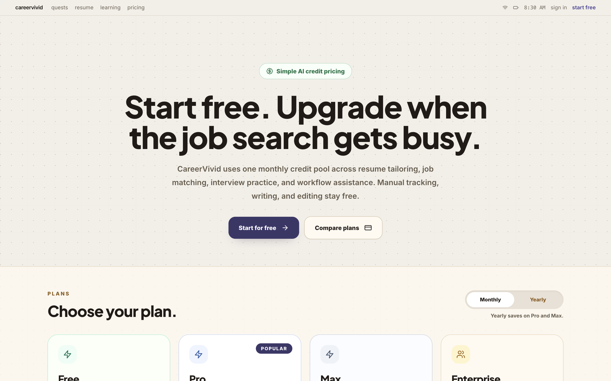

## Test account (for reviewers)

A shared demo account is available so you can explore the full experience at
[careervivid.app](https://careervivid.app) without setting anything up. Email
[support@careervivid.app](mailto:support@careervivid.app) and we will send you
the credentials directly — we don't publish them here.

## Built around the candidate loop

CareerVivid keeps the work that usually lives across a resume editor, job board,
interview prep site, and course platform in one connected workflow:

1. Choose the resume and application profile that represent the role you want.
2. Review explainable job matches that account for your evidence, preferences,
   and location.
3. Prepare with company-style recruiter, coding, system-design, and behavioral
   practice.
4. Use feedback to choose the next course lesson, practice task, or application
   action.
5. Return at any time and continue from the exact unfinished lesson or stage.

The product uses a warm editorial presentation for public learning and
competition documentation, and a compact neutral workspace for repeated
candidate work. The README follows that same approach: real screens, concise
explanations, and reproducible evidence.

## See the product

### Build the resume

The resume builder is public: 36 templates, AI drafting from your own
experience, ATS-aware scoring, and unlimited PDF export on the free plan.

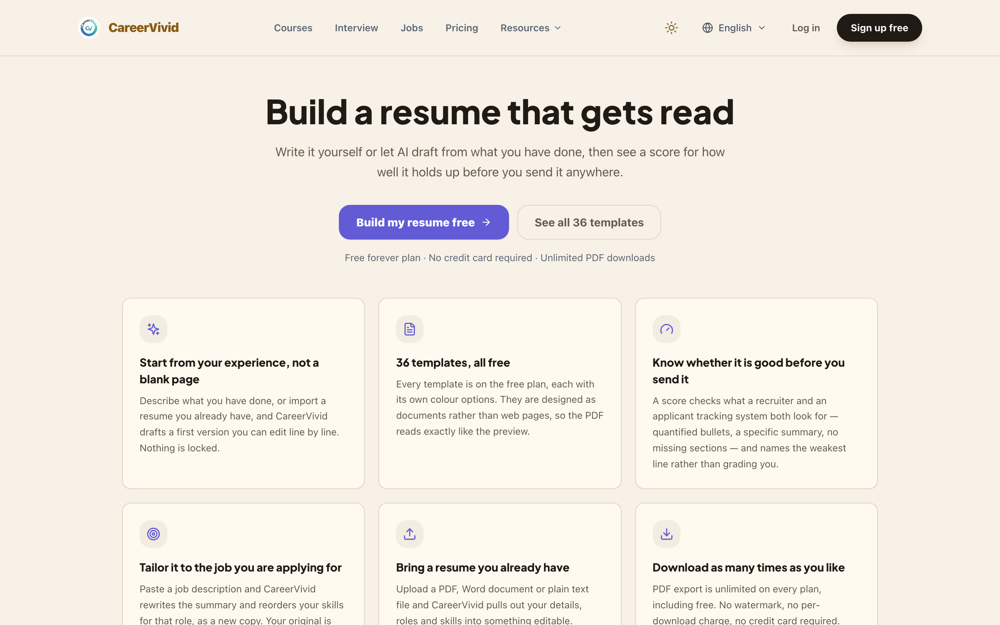

Templates are grouped by the choice a reader actually makes — classic,
creative, technical, minimal — and switching keeps your content, so comparing
designs costs nothing.

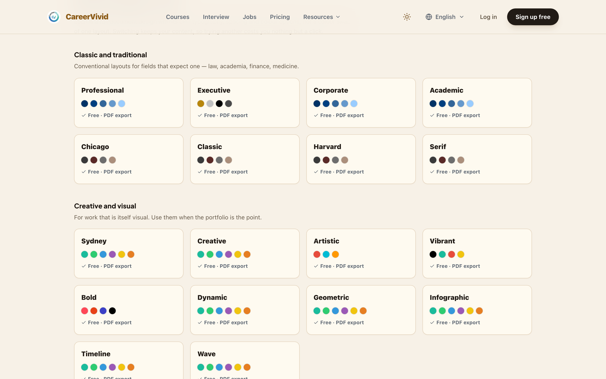

Inside the editor, the template picker, the live PDF preview, the resume
score, and the Career Agent sit on one screen — so a suggestion, the change
it describes, and the score it moves are all visible at once.

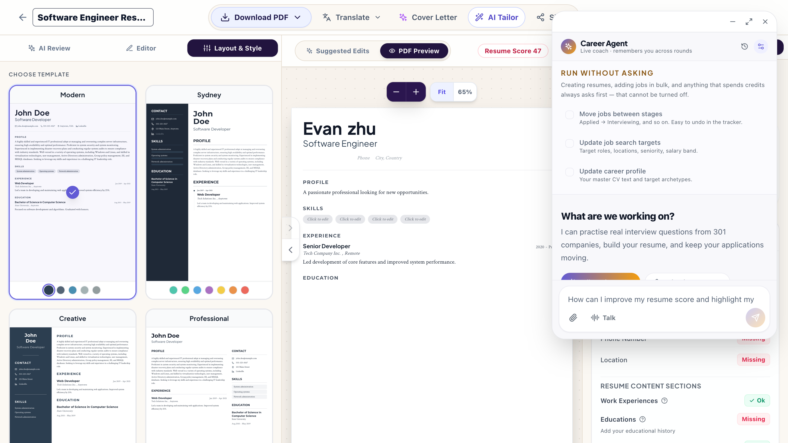

### Find the next role

The dashboard turns a selected resume, target role, readiness, interview
activity, and next action into a job-search operating plan.

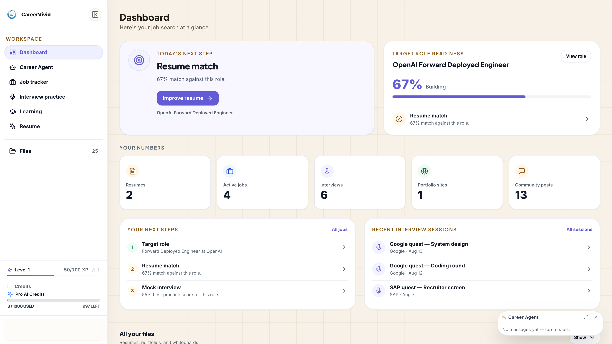

Job recommendations stay tied to the selected target resume. Each role makes
the evidence, gaps, work arrangement, salary information, and direct action
visible instead of presenting an unexplained match number.


Anyone can browse the same listings without an account. Every posting is
fetched from a company's own applicant tracking system and re-checked before it
is shown, so a role that has closed is removed rather than left to waste an
application. The match score is what an account adds, because a score is a
comparison against a resume.

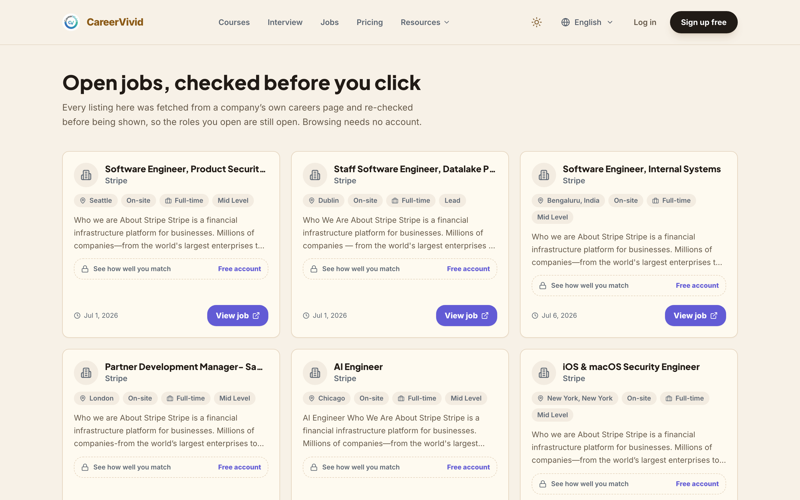

### Practice the interview loop

Interview Studio brings together saved sessions, company guides, preparation
formats, difficulty, and career paths. Guides cover 301 companies, and each one
is built from the questions candidates reported being asked there.

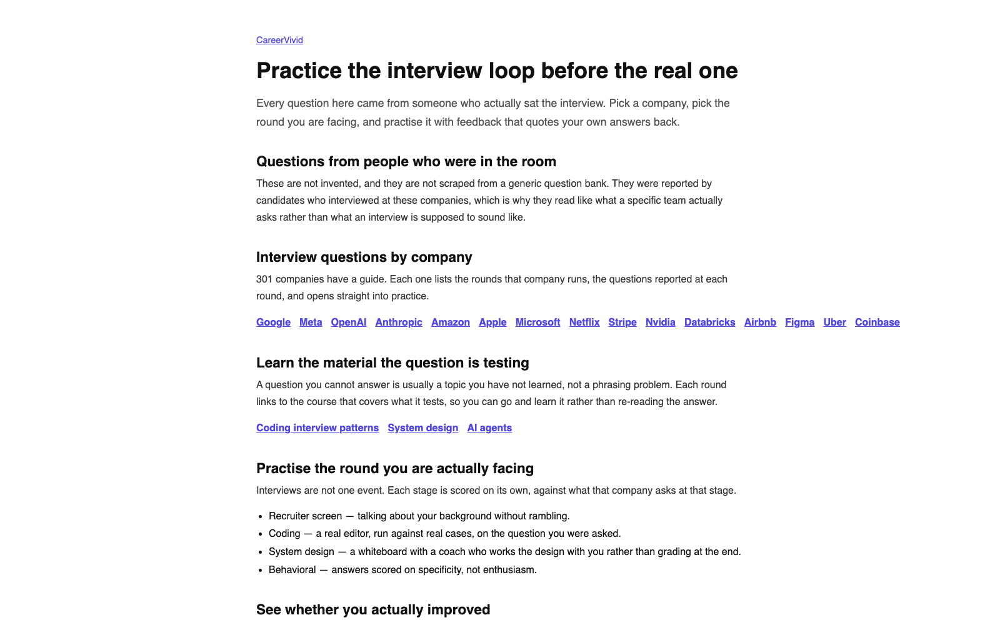

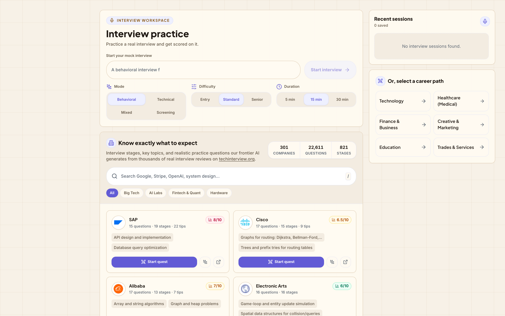

A Company Quest gives the learner a visible stage map for recruiter, coding,
system-design, behavioral, and final-round preparation.


The practice surfaces retain the prompt, requirements, work area, and feedback
context in the same place so the next action is clear.

<details>
<summary><strong>Open the interview-practice gallery</strong></summary>

<br />

**Live recruiter practice** keeps the question queue, task requirements,
transcript, session path, and live signals on one screen.


**Targeted coding practice** lets a candidate reopen the specific problem that
needs work, then use a language-aware editor, tests, and AI review.


**System-design practice** pairs an editable whiteboard with clear requirements,
AI diagram review, and coaching. Course exercises use a course-owned return
path, so closing a whiteboard returns the learner to the same course lesson.

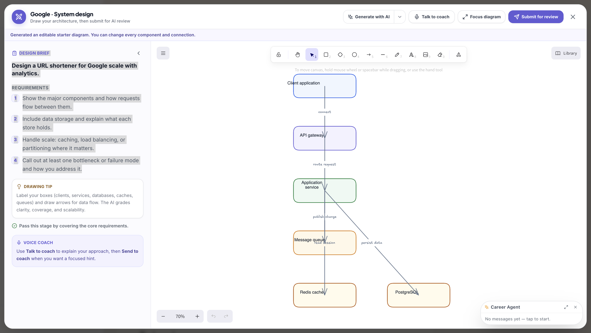

**Interview reports** turn each attempt into focused strengths and the next
improvements to practice.

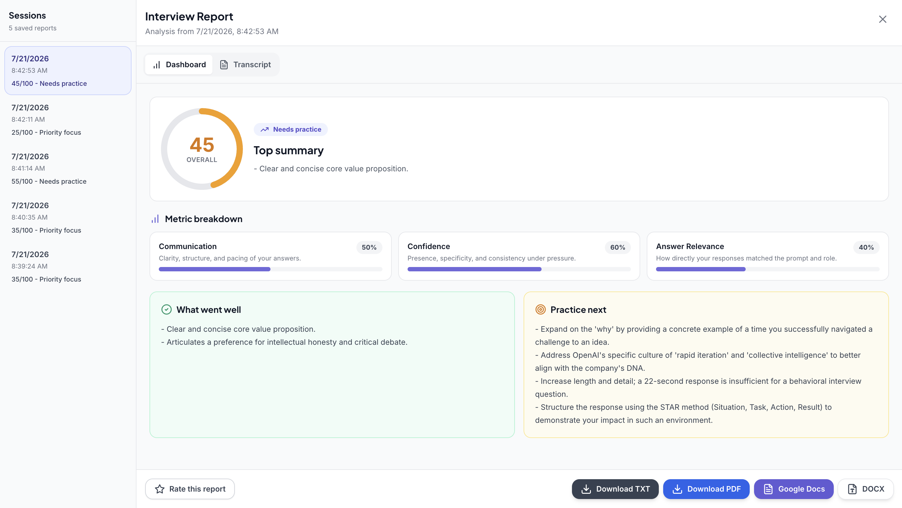

</details>

### Certify what you learned

The Claude Certified Architect track scores readiness per domain and gates each
lesson behind the one before it. Lessons are places rather than list items, and
the same material can be worked through as a 3D quest.

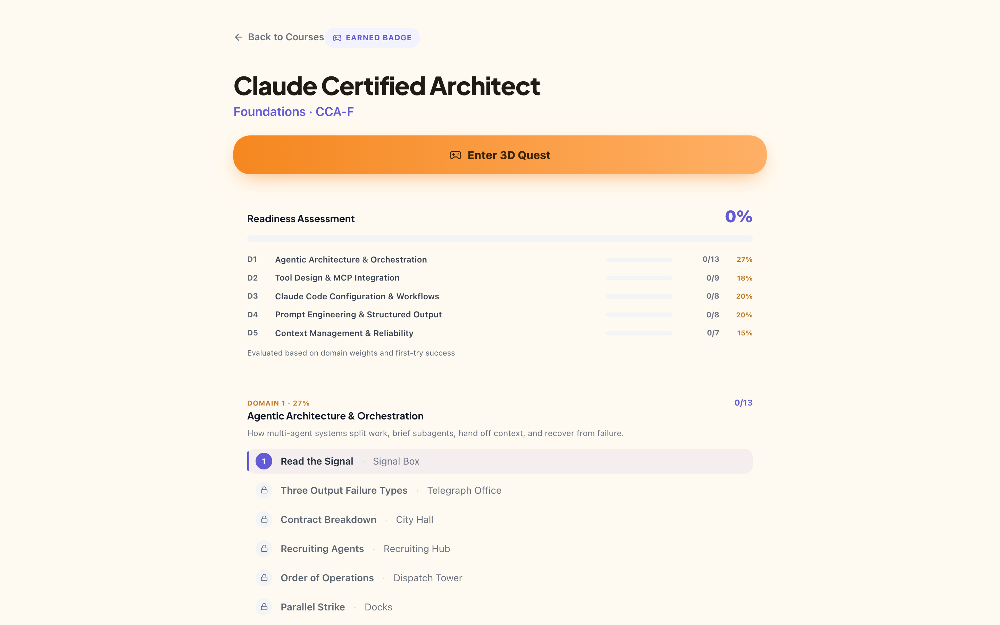

### The Career Agent

A coach that follows you across the product rather than living on one page. It
reads the round you actually have open — the code buffer in a coding round, the
canvas in a system-design one — so it coaches what is on your screen instead of
asking you to describe it.

In a coding round it can see whether your code parses, and offers the fix as a
diff you approve before anything reaches your editor. It will make your code
run; it will not write the solution, because that is what the round is
measuring. Anything it changes on your resume or job tracker arrives the same
way: as a card you approve, never as a silent write.

### Learn by doing

The course catalog connects interview preparation to a structured learning
plan. Progress is saved per lesson; a bare course link resolves to the next
incomplete exercise rather than resetting the learner to the first lesson.

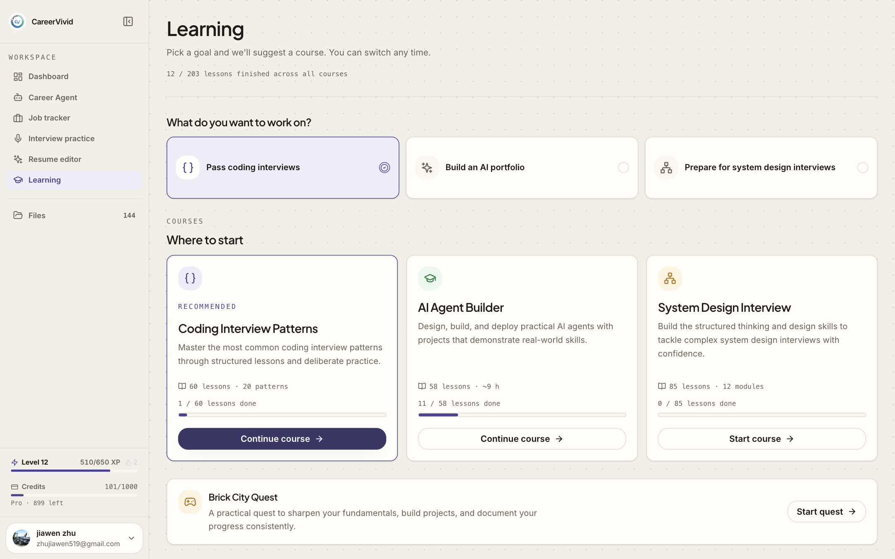

Each course opens on a roadmap rather than lesson one: pick the level that
matches the interviews you are preparing for, and every pattern carries its
recognition signals, a step-through animation, and a practice lab.

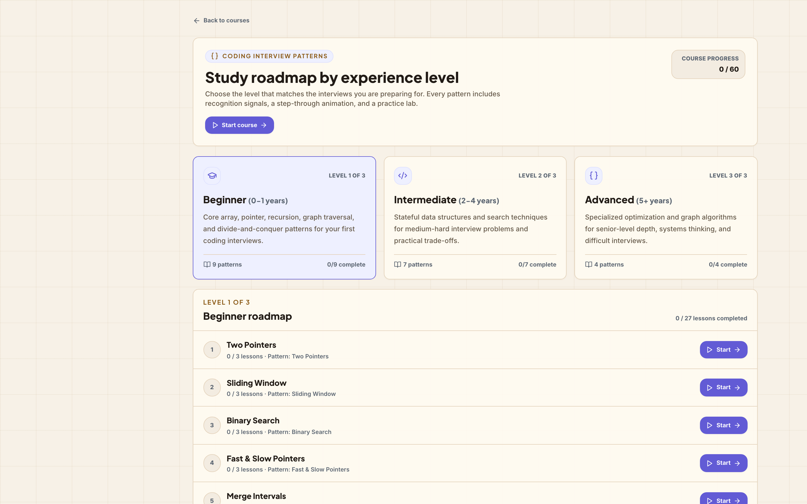

Published courses include:

- **AI Agent Builder Curriculum**: foundations through capstone work using
  readings, interactive playgrounds, videos, quizzes, and code labs.
- **Coding Interview Patterns**: step-through algorithm visualizations and
  runnable practice exercises.
- **System Design Interview**: twelve modules of deterministic simulations,
  scenario decisions, whiteboard exercises, answer drills, and timed mock
  practice.

<details>
<summary><strong>Open the interactive-learning gallery</strong></summary>

<br />

Interactive lessons model a real, observable state rather than using motion as
decoration. Learners change inputs, see the resulting behavior, and complete
the stated lesson criterion.

**Tokens and cost intuition**


**Context-window behavior**


**Curated source material in context**


**Retrieval-Augmented Generation**


</details>

## How it is put together

| Area | Implementation |
| --- | --- |
| Application | React, TypeScript, Vite, Tailwind CSS, and Framer Motion |
| Identity and persistence | Firebase Auth and Firestore |
| Job data | Official ATS and career-board ingestion with apply-link validation |
| Job matching | Resume, role requirements, experience evidence, location, work preferences, and available compensation information |
| Interview practice | Voice sessions, coding runner, Excalidraw whiteboard, and AI feedback |
| Career Agent | Gemini Live voice plus a text agent over a shared tool registry, with every write gated behind user approval |
| Search | Crawler-rendered HTML and a generated sitemap served from Cloud Functions |
| Course delivery | JSON course definitions rendered through a React widget registry |
| AI services | Gemini through controlled application services |
| Hosting | Firebase Hosting |

```text
data/courses/*.json -> course engine -> lesson pages -> saved lesson progress
                                      |
src/components/CourseWidgets/ -> deterministic simulations
                                      |
src/lib/companyQuests.ts -> company-specific prompts and stages
                                      |
functions/ -> job ingestion, AI services, and SEO generation
```

## Run locally

```bash
git clone https://github.com/JiawenZhu/CareerVivid.git
cd CareerVivid
npm ci
npm run dev
```

For local product integrations, provide the required Firebase and AI service
environment values. The Vite development server then exposes the application
locally.

### Verify the application

```bash
npm test -- --run
npm run build:vite
```

The suite covers course contracts and widget registration, deterministic
system-design simulation steps, question-bank contracts, resume template
contrast across every theme colour, the SEO content served to crawlers, and the
agent's tool gates. The Vite build confirms the production bundle can be
generated.

To refresh the product screenshots this README embeds:

```bash
node scripts/capture-readme-screenshots.mjs
```

Public pages only — signed-in surfaces would put one person's real resumes and
job matches into a public repository.

## Repository guide

| Path | Purpose |
| --- | --- |
| [`COMPETITION.md`](COMPETITION.md) | Competition provenance, evaluator path, and submission verification |
| [`CONTRIBUTING.md`](CONTRIBUTING.md) | Contribution workflow and course-content licensing rules |
| `data/courses/` | Data-driven course definitions |
| `data/interview-guides/` | Company interview-guide content |
| `docs/screenshots/` | The product evidence used in this README |
| `src/components/CourseWidgets/` | Interactive course simulations |
| `src/components/Quest/` | Company Quest coding and system-design practice |
| `src/features/agent/` | Career Agent panel, live voice session, and approval cards |
| `scripts/capture-readme-screenshots.mjs` | Regenerates the product screenshots above |
| `src/pages/` | Application routes and product surfaces |
| `functions/` | ATS ingestion, AI services, and SEO generation |

## Competition submission

| Item | Evidence |
| --- | --- |
| Submission branch | [`competition-2026`](https://github.com/JiawenZhu/CareerVivid/tree/competition-2026) |
| Eligibility marker | [`competition-start`](https://github.com/JiawenZhu/CareerVivid/tree/competition-start) |
| First qualifying commit | [`42320189`](https://github.com/JiawenZhu/CareerVivid/commit/423201899f3717876c8f3645eaaffed57c5028b8) |
| Competition window | May 19, 2026 at 10:00 AM PDT to August 17, 2026 at 1:00 PM PDT |
| Evaluator guide | [`COMPETITION.md`](COMPETITION.md) |

The annotated `competition-start` tag marks the first qualifying commit after
the competition opened. The repository preserves its actual history; timestamps
and earlier commits have not been rewritten.

## License and contributions

CareerVivid is source-available for personal learning and job-search use.
Commercial use of this Software is strictly prohibited. Any commercial use or licensing inquiries must be directed to CareerVivid at evan@careervivid.app or support@careervivid.app. Course source materials retain their original licenses; see `data/learning/sources.json`.

Contributions are welcome. Start with [CONTRIBUTING.md](CONTRIBUTING.md) for
the development workflow, focused-test expectations, and content licensing
requirements.
