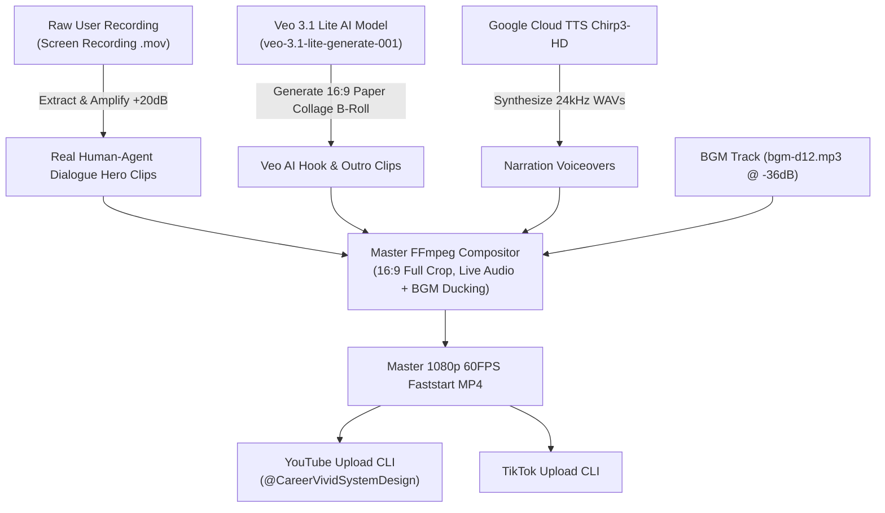

# 🎬 Skill: CareerVivid Commercial Video Production Pipeline

This Skill defines the standardized, reproducible workflow for creating high-converting commercial videos for CareerVivid using real screen recordings, Veo 3.1 Lite AI video, and automated CLI publishing.

---

## 🎯 Production Architecture & Core Principles



### Key Production Rules
1. **Hero Content (Unmuted Live Dialogue)**:
   - Real screen recordings of user interactions (System Design Studio, Career Coach Agent speech bubbles, ATS optimizer, interview loops) MUST be the core hero content (~60-70% of video duration).
   - **DO NOT MUTE** the recording during real interaction clips! Unmute and amplify the original recorded voice/audio using `volume=20dB,loudnorm` so viewers hear authentic human & Career Agent dialogue.
2. **AI Cinematic Footage (Veo 3.1 Lite)**:
   - Use `veo-3.1-lite-generate-001` exclusively for intro hooks, AI neural connections, and celebratory outro cards.
   - Strict constraint: ZERO text, zero letters, zero numbers, zero watermark in AI prompts.
3. **Audio Balancing**:
   - Narration intro/outro: Chirp3-HD Fenrir (24 kHz LINEAR16 WAV).
   - Hero dialogue clips: Live unmuted recorded audio (+20dB).
   - Background music (`bgm-d12.mp3`): Ultra-low background volume (`volume=0.015` / -36dB) with smooth 1.5s fade-in / 2.0s fade-out.
4. **100% Full-Frame 16:9 Crop**:
   - Always use `scale=1920:1080:force_original_aspect_ratio=increase,crop=1920:1080,fps=60` to eliminate black letterbox bars.
   - H.264 profile: High Profile Level 4.1 (`yuv420p`), `-movflags +faststart`, 48 kHz stereo AAC audio for 100% QuickTime and browser compatibility.

---

## 📋 Step-by-Step Production Pipeline

### Step 1: Implementation Plan & Script Blueprint (`implementation_plan.md`)
Always create an implementation plan artifact detailing the multi-beat structure before running video scripts:

```markdown
# 🎬 Implementation Plan: Commercial Video

## Multi-Beat Structure
- **Beat 1 (Hook)**: Veo 3.1 Lite AI Video (6-8s) + Chirp3-HD Narration
- **Beat 2 (Solution)**: Veo 3.1 Lite AI Video (6-8s) + Chirp3-HD Narration
- **Beat 3 (Human Interaction)**: Real Screen Recording Clip (15-20s) + LIVE UNMUTED AUDIO
- **Beat 4 (Agent In-Depth Analysis)**: Real Screen Recording Clip (25-30s) + LIVE UNMUTED AUDIO
- **Beat 5 (Live Quest Coaching)**: Real Screen Recording Clip (15-20s) + LIVE UNMUTED AUDIO
- **Beat 6 (Outro CTA)**: Veo 3.1 Lite AI Video (6-8s) + Chirp3-HD Narration + careervivid.app Endcard
```

---

### Step 2: Hero Clip Extraction with Boosted Live Audio (`scripts/extract-agent-dialogue-clips.mjs`)
Extract high-energy interaction windows from the user's raw `.mov` file:

```javascript
import fs from 'fs';
import path from 'path';
import { execSync } from 'child_process';

const INPUT_MOV = path.resolve('public/commercial-videos/careervivid-github-style/assets/real_user_recording.mov');
const OUT_DIR = path.resolve('public/commercial-videos/careervivid-system-design/assets/agent_dialogue');

fs.mkdirSync(OUT_DIR, { recursive: true });

const CLIPS = [
    { name: 'human_prompts_agent.mp4', start: 35, duration: 25, targetDuration: 20, label: 'Human Prompting' },
    { name: 'agent_evaluates_system.mp4', start: 60, duration: 40, targetDuration: 30, label: 'Career Agent Analysis' },
    { name: 'agent_coaching_dialogue.mp4', start: 110, duration: 25, targetDuration: 20, label: 'Career Coach Feedback' }
];

for (const c of CLIPS) {
    const outPath = path.join(OUT_DIR, c.name);
    const ptsScale = (c.targetDuration / c.duration).toFixed(3);
    const atempo = (c.duration / c.targetDuration).toFixed(3);

    const cmd = `ffmpeg -y -ss ${c.start} -i "${INPUT_MOV}" -t ${c.duration} -filter_complex "[0:v]setpts=${ptsScale}*PTS,scale=1920:1080:force_original_aspect_ratio=increase,crop=1920:1080,fps=60[v];[0:a]atempo=${atempo},volume=20dB,loudnorm[a]" -map "[v]" -map "[a]" -c:v libx264 -profile:v high -level 4.1 -pix_fmt yuv420p -preset fast -crf 16 -c:a aac -ar 48000 -ac 2 -b:a 192k "${outPath}"`;
    execSync(cmd, { stdio: 'pipe' });
}
```

---

### Step 3: Veo 3.1 Lite AI Video B-Roll Generation (`scripts/generate-system-design-commercial-veo.mjs`)
Generate 16:9 paper-collage mood clips using `@google/genai`:

```javascript
const MODEL = 'veo-3.1-lite-generate-001';
const VEO_BEATS = [
    {
        id: 'veo_beat1_hook',
        prompt: 'SHOT: Medium wide shot, 12 FPS stop-motion paper collage animation. STYLE: Premium paper-collage style, vintage newsprint backdrop, clean paper cutouts. ACTION: A paper engineer cutout at a paper server network whiteboard with pulsing red warning indicator tags. Negative Constraints: no text, no letters, no numbers, no words, no symbols, no signage, no watermark.'
    },
    {
        id: 'veo_beat5_outro',
        prompt: 'SHOT: Center framing, 10% slow camera push in. STYLE: Premium paper-collage style. ACTION: Golden paper trophy cutout snaps down at center frame with paper star cutouts. Negative Constraints: no text, no letters, no numbers, no words, no symbols, no signage, no watermark.'
    }
];
```

---

### Step 4: Narration Synthesis (`scripts/generate-commercial-narration.mjs`)
Synthesize 24 kHz LINEAR16 Chirp3-HD Fenrir voiceover WAV files for intro and outro beats.

---

### Step 5: Master Video Compositor (`scripts/build-system-design-commercial.mjs`)
Clean `temp_beats` on every run, escape special characters in lower-third labels, and assemble:

```javascript
const cmd = `ffmpeg -y -i "${rawConcatMp4}" -stream_loop -1 -i "${BGM_PATH}" -filter_complex "[1:a]volume=0.015,afade=t=in:st=0:d=1.5,afade=t=out:st=${(totalDur - 2.0).toFixed(1)}:d=2.0[bgm];[0:a][bgm]amix=inputs=2:duration=first:dropout_transition=2[a]" -map 0:v -map "[a]" -c:v copy -c:a aac -ar 48000 -ac 2 -b:a 192k -movflags +faststart "${OUT_MP4}"`;
```

---

### Step 6: Multi-Platform Deployment (YouTube & TikTok CLI)

1. **Generate 16:9 Thumbnail**:
   Generate paper-collage thumbnail using `generate_image` tool.
2. **YouTube CLI Upload**:
   ```bash
   node scripts/upload-careervivid-youtube-video.mjs \
     --video public/commercial-videos/careervivid-system-design/careervivid_system_design_commercial.mp4 \
     --thumbnail <thumbnail_path> \
     --title "Master System Design Interviews with AI Career Agent | CareerVivid" \
     --description "Master System Design & FAANG Interview Loops with CareerVivid AI Career Agent.\n\nPractice Interactive System Design: https://careervivid.app/learning/system-design-interview\nCoding Patterns: https://careervivid.app/learning/coding-interview-patterns\n300+ Real Interview Questions: https://careervivid.app/interview-studio"
   ```
3. **TikTok CLI Upload**:
   ```bash
   node scripts/upload-tiktok-video.mjs \
     --video public/commercial-videos/careervivid-system-design/careervivid_system_design_commercial.mp4 \
     --thumbnail <thumbnail_path> \
     --caption "Master System Design interviews with CareerVivid AI Career Agent! 🚀 Practice interactive scenarios at careervivid.app #systemdesign #softwareengineer #techinterview #careervivid #careeragent"
   ```

---

## 🛠️ Maintenance & Reuse Instructions
Whenever you receive a new user screen recording file:
1. Place the recording in `public/commercial-videos/careervivid-github-style/assets/real_user_recording.mov`.
2. Run `node scripts/extract-agent-dialogue-clips.mjs` to extract dialogue clips with unmuted audio.
3. Run `node scripts/build-system-design-commercial.mjs` to compile the master commercial video.
4. Overwrite static files and launch QuickTime Player via `open`.
5. Deploy to YouTube and TikTok via CLI upload tools.
